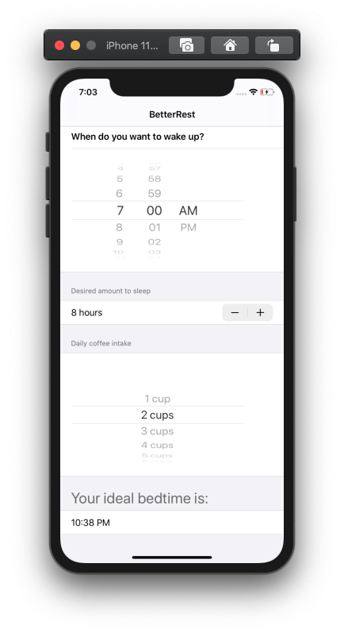

# BetterRest App

    

    
    
    

BetterRest SwiftUI Tutorial by Paul Hudson

## Covered
* Stepper
* DatePicker
* DateFormatter
* Intro to CreateML

* Connecting Core ML model
* Added basic user interface

Wrap up
* Replaced VStacks with Sections
* Replaced Stepper with Picker for #cups
* Removed calculate button
