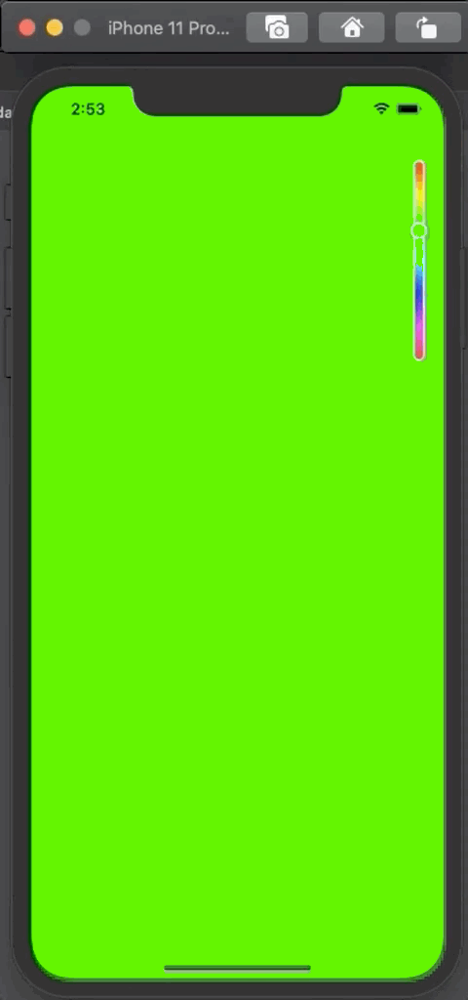

# Color Picker App

    

    
    
    

Followed great [tutorial](https://levelup.gitconnected.com/swiftui-create-a-custom-gradient-color-picker-like-snapchats-bcf508e69380) by Brandon Baars

## Covered
* @State properties
* @Binding properties
* LinearGradient
* Basic Shapes
* Modifiers
* Drag Gestures
* Basic Animations 
