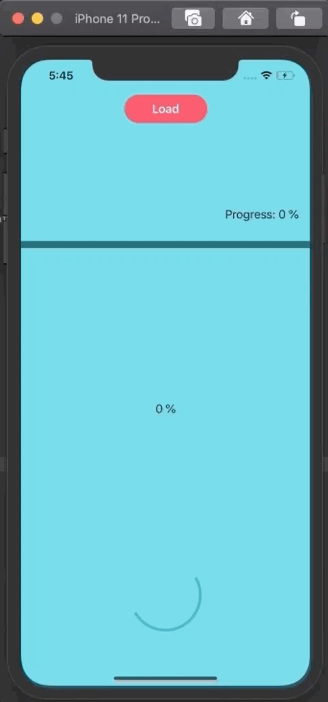

# Progress Bars App

    

    
    
    

Followed great [tutorial](http://www.gfrigerio.com/progress-bar-in-swiftui/) by Gualtiero Frigerio

## Covered
* @State properties
* Shapes
* GeometryReader
* GeometryProxy
