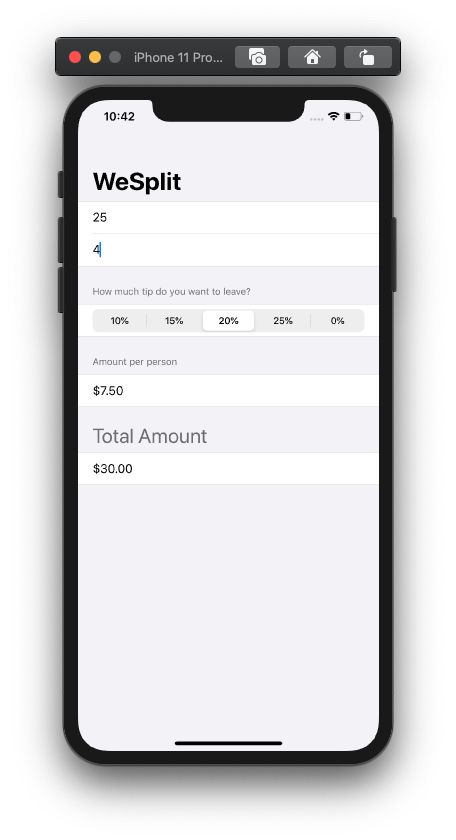

# WeSplit App

    

    
    
    

WeSplit SwiftUI Tutorial by Paul Hudson

## Covered
* @State properties
* NavigationView
* Section
* Group
* ForEach
* Picker

Day 9
* Reading text from TextField
* Add picker in a form
* Segmented control style

Day 10 - Challenge
* Add a header “Amount per person”
* Add another section with total amount for the check
* Change the “Number of people” picker to be a text field
