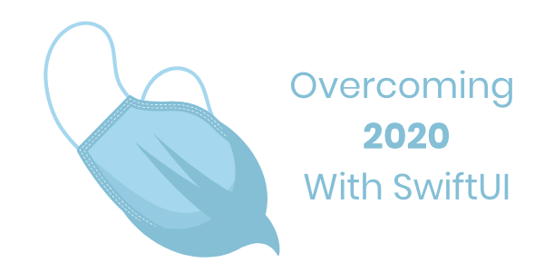

# 100 Days of SwiftUI & Combine

    

    
    
    

:point_up: Banner Provided by my beloved wife [Gabriela Gonzalez](https://www.linkedin.com/in/gaby-gonzalez-holguin/) :heart: :ok_hand:

&nbsp;

_The creation of this repository is a way to remind me the extraordinary importance of being prepared; we know that many things will happen at a certain time, but somehow we are still largely unprepared. So hopefully this time, these lessons, like many others, will stick around for a long time._

Projects and other material made while following along with [Paul Hudson’s 100 Days of SwiftUI course](https://www.hackingwithswift.com/100/swiftui) -- and many other great tutorials provided by amazing developers.
